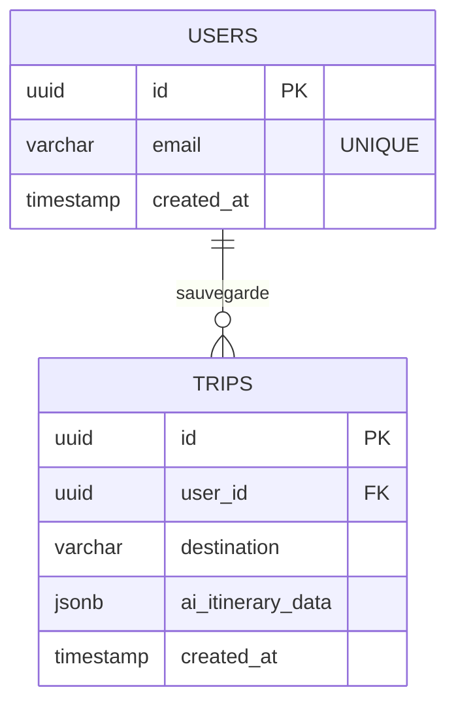

# DOSSIER DE PROJET (DPJ) - TRIPGENIE

**Candidat :** Alexis Laubert
**Titre visé :** Développeur Web et Web Mobile (RNCP 5)

---

## I. PRÉSENTATION DU PROJET ET DE LA DÉMARCHE

### 1.1 Contexte et problématique
Le secteur du tourisme est en pleine mutation. S'il existe aujourd'hui des milliers d'agences de voyage en ligne, les utilisateurs se retrouvent souvent perdus face à une quantité trop abondante d'informations, d'avis contradictoires et de parcours de réservation complexes. De la recherche de la destination idéale à l'organisation de l'itinéraire sur place, la charge mentale pour le voyageur est importante.

**L'objectif de mon projet est de simplifier et de personnaliser drastiquement la préparation d'un voyage grâce à l'Intelligence Artificielle.**

### 1.2 La solution : TripGenie
C'est dans ce contexte que j'ai conçu et développé **TripGenie**. Il s'agit d'un Agent Autonome (Assistant IA de voyage) développé de zéro. Contrairement aux solutions traditionnelles où l'utilisateur doit chercher lui-même chaque élément de son voyage, TripGenie fonctionne via une interface conversationnelle simple.
L'utilisateur exprime un besoin naturel (ex: *"Je veux un week-end étudiant pas cher en Europe au mois d'août"*) et l'application se charge de :
*   Trouver la destination adéquate.
*   Concevoir un itinéraire.
*   Sauvegarder ce voyage dans l'espace personnel de l'utilisateur.

### 1.3 Rôles et méthodologie
J'ai assuré le rôle de développeur Full-Stack (Front-end et Back-end). Le projet a été géré de manière agile, avec un découpage en fonctionnalités (Authentification, Génération IA, Affichage des voyages). Le versioning a été effectué rigoureusement avec Git et hébergé sur un dépôt GitHub, assurant une traçabilité du code source.

---

## II. CONCEPTION ET MAQUETTAGE

### 2.1 Analyse fonctionnelle (User Stories)
Pour guider le développement, j'ai identifié les parcours utilisateurs clés :
*   *En tant qu'utilisateur non connecté*, je peux m'inscrire ou me connecter de manière sécurisée.
*   *En tant qu'utilisateur connecté*, je veux pouvoir discuter avec l'IA pour qu'elle génère un plan de voyage complet.
*   *En tant qu'utilisateur connecté*, je veux pouvoir accéder à l'historique de mes précédents voyages générés.

### 2.2 Identité visuelle et maquettage (Activité 1)
L'interface a été pensée pour être minimaliste, immersive et "Mobile-First". J'ai réalisé des maquettes en amont pour définir les zones d'interaction (La barre de chat IA en bas, les cartes de résultats en haut).
> *(Note pour la rédaction finale : Insérer ici 2 captures d'écran de tes maquettes Figma/Whimsical).*

### 2.3 Modélisation des données (Activité 2)
Pour stocker de manière persistante les utilisateurs et leurs voyages générés par l'IA, j'ai modélisé une base de données relationnelle sous PostgreSQL via la plateforme Supabase.

**Modèle Conceptuel de Données (MCD) :**

L'intégrité des données est garantie par une clé étrangère liant un voyage à un utilisateur unique, avec une contrainte de suppression en cascade.

---

## III. CHOIX TECHNIQUES ET ARCHITECTURE

### 3.1 Architecture globale
L'application repose sur une architecture découplée (Client / Serveur API) :
*   **Le Client (Front-end) :** Gère l'affichage, les interactions et l'état de l'application.
*   **L'API Gateway (Back-end) :** Reçoit les requêtes HTTP du client, interroge l'IA (OpenRouter) de manière sécurisée (sans exposer la clé API au client), communique avec la base de données, et renvoie le JSON formaté.

### 3.2 Le Front-end
*   **React 18 & Vite.js :** J'ai choisi React pour sa logique de composants réutilisables (ex: le `ChatWidget`) et Vite.js pour la rapidité de compilation.
*   **TailwindCSS :** Pour un stylisme directement dans les classes utilitaires, permettant une mise en page très rapide et totalement responsive.
*   **Zustand :** Pour la gestion de l'état global (ex: savoir si l'utilisateur est connecté) de manière plus légère que Redux.

### 3.3 Le Back-end
*   **Node.js & Express.js :** Le serveur est construit sur Express pour créer une API RESTful facilement maintenable.
*   **Supabase (PostgreSQL) :** Utilisé comme "Backend as a Service" pour la base de données et l'authentification.
*   **API OpenRouter (LLMs) :** Choix d'un agrégateur d'Intelligence Artificielle pour pouvoir requêter différents modèles (Gemini, Claude, Llama) afin de générer les voyages.

---

## IV. DÉVELOPPEMENT ET PREUVES DE RÉALISATION

### 4.1 Interface dynamique et requêtes asynchrones (Front-end)
Le cœur de l'application est la génération du voyage. Cette opération peut prendre plusieurs secondes côté IA. J'ai donc dû implémenter une gestion fine de l'asynchrone sur le front-end pour informer l'utilisateur de l'avancée sans bloquer l'interface (affichage d'un "Loader").

**Extrait de code :**
```javascript
// Fonction asynchrone côté Front-end (React) pour appeler l'API
const handleGenerateTrip = async (promptText) => {
    setIsLoading(true); // Déclenche l'animation de chargement
    try {
        const response = await fetch('http://localhost:3000/api/ai/generate', {
            method: 'POST',
            headers: { 'Content-Type': 'application/json' },
            body: JSON.stringify({ prompt: promptText })
        });
        
        const data = await response.json();
        setTripResult(data); // Mise à jour de l'état avec les données du voyage
    } catch (error) {
        setErrorMessage("Une erreur est survenue.");
    } finally {
        setIsLoading(false); // Arrêt de l'animation
    }
};
```

### 4.2 Composants métiers et sécurité (Back-end)
Côté serveur, j'ai dû sécuriser l'accès à la route générant l'IA. Pour éviter les abus financiers (appels IA trop fréquents), j'ai mis en place un système de "Rate Limiting" et une vérification stricte du payload.

**Extrait de code :**
```javascript
// server/routes/ai.js
import express from 'express';
import { rateLimit } from 'express-rate-limit';

const router = express.Router();

// Sécurité : Limite à 5 générations de voyage par minute par utilisateur
const aiLimiter = rateLimit({
  windowMs: 60 * 1000,
  max: 5,
  message: { error: 'Limite de génération atteinte, veuillez patienter.' }
});

router.post('/generate', aiLimiter, async (req, res) => {
    try {
        const { prompt } = req.body;
        // Appel au service LLM protégé (La clé API reste cachée sur le serveur)
        const tripData = await callAIService(prompt); 
        res.status(200).json(tripData);
    } catch (err) {
        res.status(500).json({ error: 'Erreur interne lors de la génération' });
    }
});

export default router;
```

---

## V. DÉPLOIEMENT ET SÉCURITÉ GLOBALE

### 5.1 Sécurité de l'application
*   **Variables d'environnement :** Toutes les clés sensibles (Supabase Key, OpenRouter Key) sont stockées dans des fichiers `.env` ignorés par Git (`.gitignore`).
*   **Headers HTTP :** Utilisation du middleware `Helmet` sur Express pour protéger l'application contre les vulnérabilités web classiques (XSS, Clickjacking).
*   **CORS (Cross-Origin Resource Sharing) :** Configuration stricte d'Express pour n'accepter que les requêtes provenant de mon interface React locale ou en production.

### 5.2 Stratégie de déploiement
*(Si le projet a vocation à être hébergé)*
La séparation Front/Back permet un déploiement optimisé :
*   Le client React (Vite) peut être déployé sur un réseau de diffusion de contenu (CDN) comme Vercel ou Netlify, garantissant un chargement quasi instantané des fichiers statiques.
*   L'API Node.js peut être conteneurisée via Docker ou hébergée sur un service cloud comme Render ou Railway.

---

## VI. CONCLUSION ET BILAN

### 6.1 Bilan du projet TripGenie
Le projet répond avec succès à sa problématique initiale. L'interface fluide couplée à la puissance de l'IA permet réellement d'alléger la charge mentale de l'utilisateur lors de la préparation de son voyage. L'architecture séparée est robuste et permet une maintenance aisée.

### 6.2 Bilan personnel (Vis-à-vis du titre RNCP 5)
Ce projet m'a permis de consolider l'ensemble des compétences attendues pour le titre de Développeur Web et Web Mobile.
J'ai pu confronter la théorie à la pratique, particulièrement sur la gestion des flux de données asynchrones (le fait d'attendre la réponse longue d'un modèle d'IA sans geler le navigateur client) et sur la rigueur qu'impose la conception d'une API RESTful sécurisée. La prochaine étape sera d'enrichir ce produit pour le rendre encore plus connecté à des données en temps réel.
