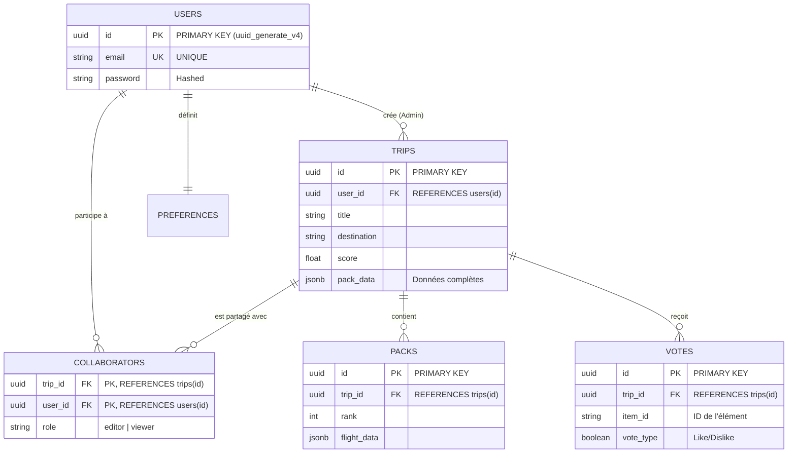

# 🎓 DOSSIER PROFESSIONNEL : PROJET TRIPGENIE
**Titre visé :** Développeur Web et Web Mobile (RNCP 5)
**Candidat :** Alexis Laubert
**Date :** Avril 2026

---

## 1. GENÈSE DU PROJET : POURQUOI TRIPGENIE ?

### 1.1. Le Constat et la Problématique
La planification d'un voyage est souvent une tâche longue et fastidieuse. Les comparateurs classiques (Skyscanner, Booking) demandent à l'utilisateur de faire le travail de recherche, de croiser les dates, et de jongler entre une dizaine d'onglets pour assembler un "pack" de voyage (Vol + Hôtel + Activités).
Le problème : l'utilisateur perd la magie de l'inspiration et se heurte à une surcharge cognitive.

### 1.2. La Solution : TripGenie
L'idée de TripGenie est née d'une volonté de simplifier drastiquement cette expérience grâce à l'Intelligence Artificielle "Agentique". Au lieu de remplir des formulaires complexes, l'utilisateur discute naturellement avec un agent (Chatbot). L'agent comprend les besoins implicites (budget, ambiance festive ou relax), cherche de manière autonome les meilleurs vols et événements, et propose un "Pack" clé en main. C'est une agence de voyage de poche.

---

## 2. CAHIER DES CHARGES ET CONTRAINTES

### 2.1. Contraintes Techniques
1. **Temps de Réponse (UX)** : L'orchestration d'APIs tierces (Vols, Événements) et de l'IA (LLMs) est très lente. Il fallait concevoir une interface (Skeleton loaders, messages de patience) pour ne pas frustrer l'utilisateur.
2. **Quotas d'API** : Les modèles d'IA (Claude, Gemini) ont des limites strictes dans leurs versions gratuites (Erreurs 429).
3. **Formatage Imprévisible** : Les IA ont tendance à halluciner ou à mal formater le JSON. Le backend devait être extrêmement robuste (Regex, parsing sécurisé) pour ne pas crasher.

### 2.2. Contraintes Pédagogiques (RNCP 5)
Le projet devait valider des compétences de conception de base de données relationnelle, de développement d'API sécurisée, et de création d'une interface dynamique côté client.

---

## 3. CHOIX TECHNOLOGIQUES ET JUSTIFICATIONS

Le socle initial acquis à Holberton reposait fortement sur le Vanilla JS et le SQL pur (Projet HBnB). Pour TripGenie, j'ai fait le choix de monter en compétence sur une "Stack" moderne (PERN/MERN).

### 3.1. Le Frontend : React.js & Zustand
*   **Pourquoi React au lieu du Vanilla JS ?** TripGenie gère beaucoup de données simultanées (les messages du chat, l'état de la recherche, les résultats des vols). Faire cela en Vanilla (avec `document.createElement`) serait devenu illisible et très dur à maintenir. React permet de compartimenter l'UI en petits "Composants" isolés.
*   **Pourquoi Zustand ?** Pour éviter de passer les variables de composant en composant ("Prop drilling"). Zustand offre un "Store" global et persistant, essentiel pour garder les données du voyage si l'utilisateur rafraîchit la page.

### 3.2. Le Backend : Node.js & Express
*   **Justification :** Utiliser JavaScript des deux côtés (Front et Back) permet une grande fluidité. Express est léger, robuste, et m'a permis de créer une API RESTful propre, capable d'orchestrer les requêtes asynchrones vers Amadeus et l'IA.

### 3.3. La Base de Données : Supabase (PostgreSQL)
*   **Pourquoi Supabase ?** Au lieu de configurer un serveur SQL local, Supabase offre un PostgreSQL hébergé avec une API JavaScript intégrée. 
*   **Le lien avec mes acquis :** J'ai pu réutiliser toutes mes compétences Holberton en rédigeant un vrai `schema.sql` relationnel (UUID, Clés étrangères `REFERENCES`, `ON DELETE CASCADE`), tout en gagnant du temps sur l'intégration Backend.

### 3.4. Les APIs Tierces
*   **Anthropic Claude & OpenRouter** : Le cerveau de l'appli pour la compréhension du langage naturel.
*   **Amadeus** : Le standard de l'industrie pour les vraies données de vols aériens.
*   **PredictHQ** : Pour injecter des événements locaux réels (Concerts, festivals) dans l'itinéraire.

---

## 4. ARCHITECTURE ET BASE DE DONNÉES

Mon architecture suit un modèle relationnel strict pour garantir l'intégrité des données, comme illustré dans le diagramme ci-dessous.

*   **Table `trips`** : Stocke l'itinéraire global. Relatif à un utilisateur (One-to-Many).
*   **Table `trip_collaborators`** : Table de jonction (Many-to-Many) permettant à plusieurs utilisateurs de partager les droits d'édition sur un même voyage.
*   **Table `trip_votes`** : Système de consensus. Lié strictement à `trips` via une clé étrangère (FK). Si le voyage est supprimé, les votes disparaissent (Cascade).

---

## 5. ÉTAT DES LIEUX : CE QUI FONCTIONNE PARFAITEMENT (Prêt pour la Prod)

Aujourd'hui, l'application possède un cœur de métier (Core Features) extrêmement solide et testé :

1.  **L'Onboarding Agentique** : Le chatbot est fluide, comprend l'utilisateur, et extrait les données (`destination`, `budget`, `mode`) de manière invisible et efficace.
2.  **L'Orchestration Asynchrone** : Le backend gère parfaitement les appels parallèles (`Promise.allSettled`) vers Amadeus et l'IA, divisant le temps d'attente par deux.
3.  **Le "Mode Survie" (Tolérance aux pannes)** : C'est une de mes plus grandes fiertés techniques. Si l'API principale tombe en panne (quota dépassé), le système "cascade" sur une dizaine de modèles de secours (OpenRouter). Si tout échoue, un système de "Mocks" s'active pour que l'utilisateur ne soit jamais bloqué.
4.  **Le Système de Vote (Consensus)** : L'API de vote est fonctionnelle, testée, et respecte l'intégrité de la base de données.
5.  **Les Tests** : Mise en place d'une suite de tests en ligne de commande (CLI) "Holberton-style" qui valide 100% des endpoints critiques de l'API.

---

## 6. DETTES TECHNIQUES ET ÉLÉMENTS À RETRAVAILLER

En tant que développeur, il est crucial de savoir analyser ses propres axes d'amélioration :

1.  **Fiabilité de l'IA (Hallucinations JSON)** : Bien que j'aie créé un parseur robuste (`parseJSON`), les LLMs renvoient parfois un format corrompu. À l'avenir, l'utilisation de méthodes comme le "Function Calling" (Tools) natif des LLMs serait plus sécurisée que le simple "Prompting".
2.  **Moteur de Recherche Amadeus** : Actuellement, le cache IATA est basique (en mémoire vive). Si le serveur redémarre, le cache est vidé. Il faudrait implémenter un vrai système de cache comme Redis.
3.  **Réservation Réelle (Booking)** : Aujourd'hui, les liens redirigent vers des recherches génériques (Google Flights, Booking.com). Il manque une intégration profonde via des liens d'affiliation générés dynamiquement.

---

## 7. ÉVOLUTIONS FUTURES

TripGenie a un potentiel fort pour évoluer d'un "Projet de Diplôme" à un véritable produit (SaaS) :

1.  **Monétisation (Affiliation)** : Intégrer les programmes partenaires (Booking.com Affiliate, Skyscanner API) pour toucher une commission sur chaque voyage réservé via la plateforme.
2.  **Comptes Utilisateurs et Social** : Activer pleinement l'authentification (Supabase Auth) pour permettre aux groupes d'amis de discuter en temps réel sur la plateforme pour planifier leur voyage.
3.  **Application Mobile (PWA / React Native)** : Le voyage se prépare sur ordinateur, mais se vit sur mobile. Transformer TripGenie en PWA (Progressive Web App) permettrait aux utilisateurs d'avoir leur itinéraire et leurs billets dans leur poche, même hors-ligne.

---

## CONCLUSION

Le projet TripGenie représente la synthèse parfaite de mon apprentissage. Il m'a permis de partir d'un socle fondamental (Logique algorithmique, Vanilla JS, bases de données relationnelles) et de l'élever vers des technologies modernes (React, IA, Orchestration d'APIs). 
Malgré les défis posés par l'imprévisibilité de l'IA et les contraintes de temps, j'ai livré une application résiliente, testée, et visuellement aboutie. C'est une architecture dont je suis fier et que je me sens prêt à défendre.
