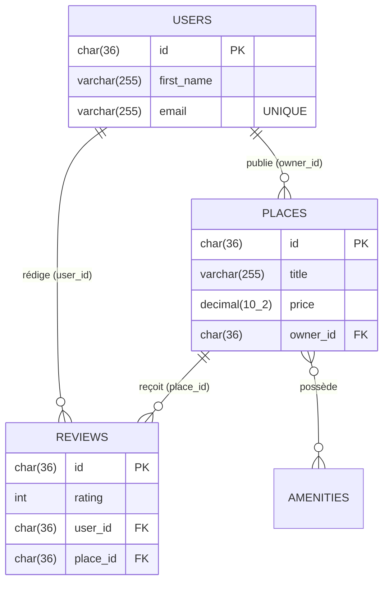

# DOSSIER PROFESSIONNEL (DP) - VERSION 1
**Titre visé :** Développeur Web et Web Mobile (RNCP 5)
**Candidat :** Alexis Laubert
**Date de rendu :** 29/04/2026

---

## INTENTION DE LA VERSION 1
*Note pour l'équipe pédagogique : Cette V1 structure le dossier autour du projet majeur "HBnB" pour valider l'ensemble des compétences Front et Back-end du REAC.*

---

## 1. PRÉSENTATION DU PROJET PRINCIPAL : HBnB

**Description courte :**  
HBnB est un clone fonctionnel d'application de type AirBnB développé tout au long de ma formation. Il s'agit d'une architecture complète (Full-Stack) allant de la ligne de commande et du stockage des données, jusqu'au client web dynamique, et orchestrée par une API RESTful.

**Technologies utilisées :** 
* **Back-end :** Python, Flask, Flask-RESTx, SQL (PostgreSQL/SQLite)
* **Front-end :** HTML5, CSS3, JavaScript (Vanilla, asynchrone)
* **Architecture :** MVC / Facade Pattern, RESTful API

---

## 2. ACTIVITÉ TYPE 1 : DÉVELOPPER LA PARTIE FRONT-END

### 2.1 Mettre en place son environnement de travail
J'ai configuré mon environnement de développement sous Visual Studio Code, en utilisant Git pour le versioning via GitHub. L'application est dockerisée (ou utilisable en script natif Linux) pour garantir l'isolement des dépendances entre la modélisation de la base de données et le déploiement du serveur web.

### 2.2 Réaliser des interfaces utilisateur statiques et adaptables
Dans le cadre de l'affichage des annonces (Places), j'ai conçu un affichage structuré en utilisant `<article>` et `<section>` pour respecter une forte sémantique HTML5. J'ai défini des feuilles de styles modulaires pour que la grille d'affichage soit adaptative peu importe la résolution d'écran du client.

### 2.3 Développer la partie dynamique des interfaces utilisateur
Afin de fluidifier l'expérience, le site agit comme une Single Page Application. J'ai utilisé l'API `Fetch` en JavaScript pur.
> *Voir Annexe A pour l'extrait de code de la gestion asynchrone et l'injection dynamique du DOM des annonces.*

---

## 3. ACTIVITÉ TYPE 2 : DÉVELOPPER LA PARTIE BACK-END

### 3.1 Mettre en place une base de données relationnelle
J'ai modélisé l'ensemble du système de réservation (Places, Utilisateurs, Évaluations, Équipements). La difficulté principale était la gestion de l'intégrité référentielle, assurant par exemple qu'un lieu soit obligatoirement relié à l'UID d'un hôte, et que la suppression de ce dernier cascade (Supprime) logiquement les lieux.
> *Voir Annexe B pour le Modèle Conceptuel (MCD) et l'extrait SQL.*

### 3.2 Développer des composants d'accès aux données
Pour simplifier les requêtes complexes et éviter les failles de type Injection SQL, le back-end exploite un schéma objet (ORM) sur le Backend couplé à une classe "Facade". La "Facade" agit comme unique point de contact entre l'API et la persistance des données.

### 3.3 Développer des composants métier côté serveur (API)
Le métier applicatif est mis à disposition via une API REST sécurisée et versionnée (`/api/v1/`). La création des routes est générée de telle sorte que seuls les utilisateurs authentifiés (JWT Token) peuvent accéder à la publication de "Places" ou de "Reviews".  
> *Voir Annexe C pour l'implémentation de la logique de création des Places en Python.*

---

## 4. ANNEXES

### ANNEXE A : Développer la partie dynamique du front-end
**Tâche :** Récupération asynchrone des logements et affichage stateful.
**Fichier :** `part4/scripts.js`

```javascript
async function fetchPlaces(token) {
    const list = document.getElementById('places-list');
    showLoader(list); // UX: Affichage d'un loader temporaire

    const headers = {};
    if (token) { headers['Authorization'] = `Bearer ${token}`; }

    try {
        const res = await fetch(`http://localhost:5000/api/v1/places/`, { headers });
        if (!res.ok) { throw new Error(`Server error ${res.status}`); }
        
        const allPlaces = await res.json();
        displayPlaces(allPlaces); // Manipulation du DOM pour l'affichage
    } catch (err) {
        showStateError(list, `Could not load places: ${err.message}`);
    }
}
```

---

### ANNEXE B : Modélisation et accès aux données relationnelles
**Tâche :** Sécuriser l'architecture de la BDD et implémenter ses tables.

**1. Diagramme Entité-Relation :**


**2. Traduction DDL (SQL) pour la création de contraintes de clé étrangère (Extrait de `create_tables.sql`) :**
```sql
CREATE TABLE IF NOT EXISTS places (
    id CHAR(36) PRIMARY KEY,
    title  VARCHAR(255)  NOT NULL,
    description TEXT,
    price DECIMAL(10, 2)  NOT NULL,
    latitude FLOAT  NOT NULL,
    longitude FLOAT  NOT NULL,
    owner_id CHAR(36) NOT NULL,
    FOREIGN KEY (owner_id) REFERENCES users(id) ON DELETE CASCADE
);
```

---

### ANNEXE C : Création d'une logique métier API en Back-end
**Tâche :** Validations des données entrantes et respect des normes HTTP.
**Fichier :** `part2/hbnb/app/api/v1/places.py`

```python
@api.route('/')
class PlaceList(Resource):
    @api.expect(place_model, validate=True) # Validation structurelle du modèle
    @api.response(201, 'Place successfully created')
    def post(self):
        """Register a new place"""
        try:
            new_place = facade.create_place(api.payload)
            return {
                'id': new_place.id,
                'title': new_place.title,
                'price': new_place.price,
                'owner_id': new_place.owner.id,
            }, 201
        except ValueError as e:
            return {'error': str(e)}, 400
```
