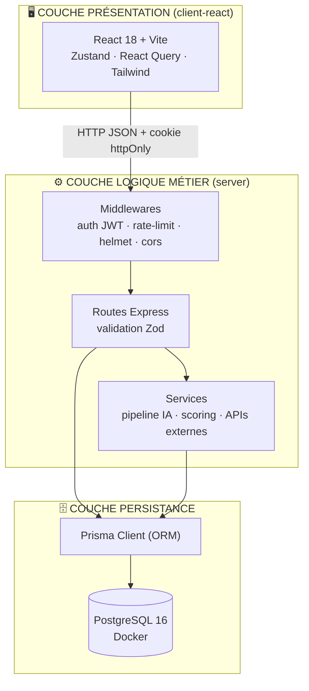
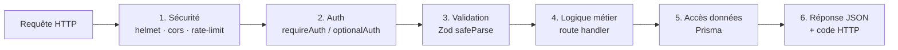
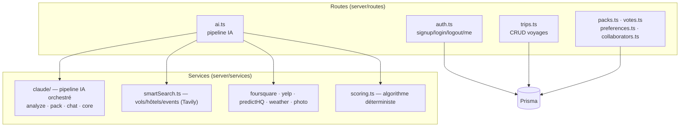
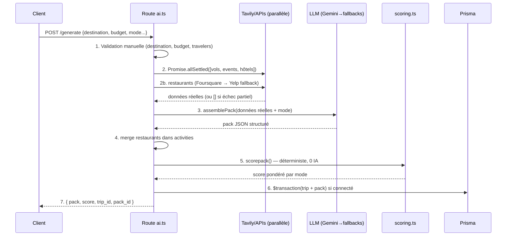
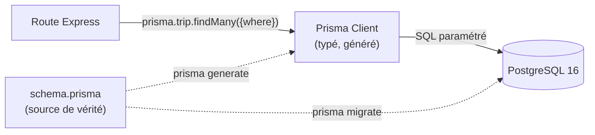
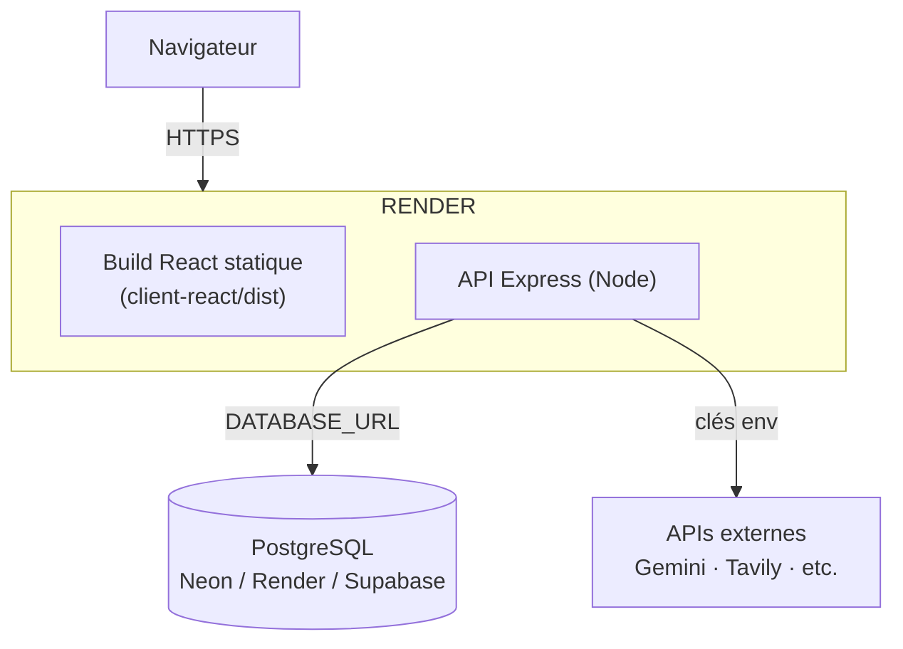

# TripGenie — Architecture & Couches logique métier
> Branche `mvp-DEMODAY` (PostgreSQL Docker + ORM Prisma)
> Document de référence technique pour l'oral RNCP5 DWWM / Holberton

---

## 1. Vue d'ensemble — Architecture 3 couches

TripGenie suit une architecture **client-serveur en 3 couches séparées**, le patron
le plus classique et le plus attendu par un jury DWWM.



**Le principe directeur : la séparation des responsabilités.**
Chaque couche ne connaît que sa voisine directe. Le frontend ne parle jamais à la
base ; il passe par l'API. L'API ne renvoie jamais de HTML ; elle renvoie du JSON.

---

## 2. Couche PRÉSENTATION (frontend)

**Rôle :** afficher l'interface, capturer les saisies, appeler l'API, gérer l'état local.

### Flux d'une interaction
```
Utilisateur clique → composant React → fonction de src/lib/api.ts
   → fetch HTTP (credentials: 'include') → réponse JSON → mise à jour du store Zustand
   → re-render automatique du composant
```

### Détail des responsabilités

| Élément | Fichier | Rôle métier |
|---------|---------|-------------|
| **Pages** | `src/pages/*` | Une page = une route URL (Home, Trips, TripDetail, Login, Preferences) |
| **Chat onboarding** | `src/components/chat/ChatWidget.tsx` | Collecte conversationnelle des critères de voyage (quiz guidé OU texte libre) |
| **Affichage pack** | `src/components/results/PackResults.tsx` | Rend le pack généré (vols, hôtels, activités, budget, météo, carte) |
| **State global** | `src/store/index.ts` | Zustand : `useAuthStore`, `useChatStore`, `useSearchStore`, `useThemeStore` |
| **Accès API** | `src/lib/api.ts` | **Point unique** de toutes les requêtes HTTP (préfixe `VITE_API_URL`, `credentials:'include'`, throw si `!res.ok`) |

> **Point clé jury :** toutes les requêtes passent par `request()` dans `api.ts`.
> C'est une **façade** : un seul endroit pour gérer le cookie, l'URL de base et les erreurs.

---

## 3. Couche LOGIQUE MÉTIER (backend)

C'est le cœur du projet. Elle se décompose en **sous-couches empilées** que chaque
requête traverse dans l'ordre :



### 3.1 — Sous-couche Sécurité (middlewares globaux)
`server/index.ts` applique dans l'ordre : `helmet()` (headers de sécurité),
`cors()` (whitelist d'origines), `express.json({limit:'1mb'})`, `cookieParser()`,
`morgan` (logs), puis les rate-limiters.

### 3.2 — Sous-couche Authentification
`server/middleware/auth.ts` expose deux gardes :
- **`requireAuth`** : bloque (401) si pas de JWT valide → routes privées (`/api/trips`…)
- **`optionalAuth`** : décode le JWT s'il existe, sinon continue → routes IA (génération possible connecté OU déconnecté)

Le token est lu depuis le **cookie httpOnly `tg_token`** (priorité) ou le header `Authorization: Bearer`.

### 3.3 — Sous-couche Validation (Zod)
Chaque route valide son `req.body` avec un schéma Zod **avant** toute logique :
```ts
const parsed = schema.safeParse(req.body);
if (!parsed.success) return res.status(400).json({ error: parsed.error.issues[0].message });
```
→ Aucune donnée non validée n'atteint jamais la base.

### 3.4 — Sous-couche Logique métier (routes + services)



**Distinction fondamentale :**
- **Routes CRUD** (auth, trips, packs, votes, preferences, collaborators) → logique simple → Prisma directement.
- **Route IA** (`/generate`) → orchestration complexe → délègue aux **services**.

#### Le pipeline IA orchestré (`POST /api/ai/generate`)


> **Pourquoi `Promise.allSettled` et pas `Promise.all` ?** `all` échoue si UNE
> promesse échoue → si la météo tombe, toute la génération s'arrête. `allSettled`
> attend tout le monde quelle que soit l'issue → dégradation gracieuse.

### 3.5 — Sous-couche Réponse
Codes HTTP sémantiques : `200` OK, `201` créé, `400` validation, `401` non authentifié,
`403` interdit, `404` introuvable, `409` conflit (email pris), `429` rate-limit.

---

## 4. Couche PERSISTANCE (Prisma + PostgreSQL)

**Rôle :** stocker et restituer les données de façon sûre et typée.



- **`prisma/schema.prisma`** : source de vérité unique du modèle de données (6 entités).
- **`prisma migrate`** : génère et applique les migrations SQL versionnées.
- **`prisma generate`** : produit un client TypeScript **entièrement typé**.
- **`server/db/prisma.ts`** : singleton du client (évite d'épuiser le pool de connexions).

### Modèle de données (ERD)
```mermaid
erDiagram
    User ||--o{ Trip : "possède"
    User ||--o| UserPreference : "1-1"
    User ||--o{ TripCollaborator : "collabore"
    Trip ||--o{ Pack : "1-N"
    Trip ||--o{ TripCollaborator : "partagé via"
    Pack ||--o{ TripVote : "voté sur"

    User {
        uuid id PK
        text email UK
        text password "hash bcrypt"
        text name
        timestamptz created_at
    }
    Trip {
        uuid id PK
        uuid user_id FK
        text destination
        date departure
        date return_date
        int travelers
        text mode
        jsonb pack_data
        float score
        text status
    }
    Pack {
        uuid id PK
        uuid trip_id FK
        int rank
        jsonb pack_data
        boolean selected
    }
    TripVote {
        uuid id PK
        uuid pack_id FK
        text item_id
        boolean vote_type
    }
    UserPreference {
        uuid user_id PK_FK
        text default_mode
        text[] preferred_prefs
        text home_city
    }
    TripCollaborator {
        uuid trip_id PK_FK
        uuid user_id PK_FK
        text role
    }
```

### Isolation des données (sécurité)
Chaque route protégée filtre par `where: { user_id }`, l'id venant du **JWT vérifié**.
Les lectures publiques (partage) utilisent un `select` explicite qui **n'expose aucune
donnée utilisateur**. Testé : User B reçoit **404** sur le voyage de User A.

---

## 5. Stack technique complète

### Frontend
| Techno | Rôle | Justification |
|--------|------|---------------|
| **React 18** | UI par composants | Écosystème mature, virtual DOM, réutilisabilité |
| **Vite** | Bundler / dev server | HMR ultra-rapide, build ESM optimisé |
| **TypeScript** | Typage statique | Détecte les erreurs à la compilation |
| **React Router v6** | Routage SPA | Navigation sans rechargement |
| **Zustand** | State global | Plus simple que Redux, API minimaliste |
| **React Query v5** | Cache requêtes | Gestion auto loading/error/cache |
| **Tailwind CSS** | Styles utilitaires | Cohérence rapide, purge du CSS inutilisé |
| **Framer Motion** | Animations | Transitions déclaratives |
| **Recharts** | Graphiques | Budget breakdown (camembert) |
| **Leaflet** | Carte | Open source, sans clé API |

### Backend
| Techno | Rôle | Justification |
|--------|------|---------------|
| **Node.js ≥18** | Runtime JS serveur | Full-stack JS = un seul langage |
| **Express 4** | Framework HTTP | Léger, pattern middleware |
| **TypeScript** | Typage | Sécurité de type bout en bout |
| **Prisma 6** | ORM | Schéma déclaratif, migrations auto, client typé |
| **Zod** | Validation | Schémas déclaratifs, messages précis |
| **jsonwebtoken** | Auth stateless | Token signé, pas de session serveur |
| **bcryptjs** | Hash mots de passe | Lent = résistant au brute-force |
| **Helmet / CORS / express-rate-limit** | Sécurité HTTP | Headers, whitelist, anti-DDoS |
| **Morgan** | Logs HTTP | Méthode/route/status/temps |

### Base de données & DevOps
| Outil | Rôle |
|-------|------|
| **PostgreSQL 16** | Base relationnelle |
| **Docker** | PostgreSQL local reproductible (1 commande) |
| **Prisma Migrate** | Migrations versionnées |
| **Prisma Studio** | Navigateur visuel de la base |

### Tests
| Outil | Rôle |
|-------|------|
| **Vitest** | Test runner (natif ESM) |
| **Supertest** | Tests d'intégration HTTP sur Express |
| **vi.hoisted + mocks** | Isolation des services externes et de Prisma |

### IA & Services externes
Gemini (principal) → OpenRouter → Claude (fallbacks) ; Tavily (recherche web),
Foursquare→Yelp (restaurants), PredictHQ (événements), OpenWeatherMap (météo),
Unsplash (photos, via proxy backend).

---

## 6. Schéma de déploiement cible



En **local pour la démo** : `PostgreSQL` tourne dans Docker, l'API en `npm run dev`,
le client en `npm run client:dev`.
