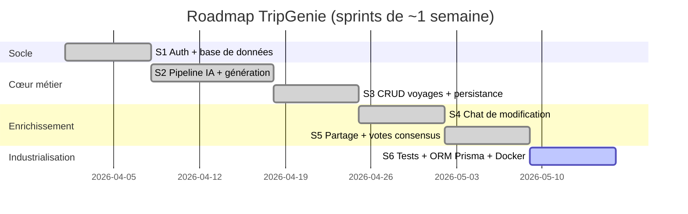

# TripGenie — Méthodologie Agile & Sprints
> Document de gestion de projet pour l'oral RNCP5 DWWM

---

## 1. Pourquoi l'agile (et pas le cycle en V) ?

TripGenie repose sur des **briques incertaines** : qualité des réponses du LLM,
fiabilité des APIs externes (Tavily, Foursquare…), faisabilité du scoring.
Le cycle en V (tout spécifier avant de coder) aurait été risqué.

➡️ J'ai travaillé en **itérations courtes (sprints)** avec un produit **fonctionnel
à la fin de chaque sprint** : on livre un incrément, on teste, on ajuste le backlog.

> **Vocabulaire à maîtriser :** Product Backlog (liste priorisée des fonctionnalités),
> User Story (« En tant que… je veux… afin de… »), Sprint (itération de 1–2 semaines),
> Definition of Done (critères pour considérer une tâche terminée), MVP (Minimum Viable Product).

---

## 2. Personas (utilisateurs cibles)

| Persona | Profil | Mode de voyage |
|---------|--------|----------------|
| **Sophie** | Cadre marketing, peu de temps | `luxury` |
| **Lucas** | Étudiant, budget 500€ | `student` |
| **Maxime** | Freelance, week-ends entre amis | `party` |

Ces personas pilotent les **priorités** du backlog.

---

## 3. Product Backlog (extrait priorisé)

| # | User Story | Priorité | Sprint |
|---|------------|----------|--------|
| US1 | En tant que visiteur, je veux décrire mon voyage en langage naturel afin d'obtenir un pack | 🔴 Haute | S2 |
| US2 | En tant que visiteur, je veux un pack complet (vols/hôtels/activités/budget) afin de ne pas chercher moi-même | 🔴 Haute | S2-S3 |
| US3 | En tant qu'utilisateur, je veux créer un compte sécurisé afin de sauvegarder mes voyages | 🔴 Haute | S1 |
| US4 | En tant qu'utilisateur, je veux retrouver mes voyages afin de les consulter plus tard | 🟠 Moyenne | S3 |
| US5 | En tant qu'utilisateur, je veux modifier mon pack par chat afin de l'affiner | 🟠 Moyenne | S4 |
| US6 | En tant qu'organisateur, je veux partager un voyage et collecter des votes afin de décider en groupe | 🟢 Basse | S5 |
| US7 | En tant que dev, je veux une base fiable et migrable afin de déployer sereinement | 🟠 Moyenne | S6 |

---

## 4. Découpage en sprints

### Sprint 1 — Socle d'authentification
- **Objectif :** un utilisateur peut s'inscrire/se connecter de façon sécurisée.
- **Livré :** routes `signup/login/logout/me`, JWT en cookie httpOnly, hash bcrypt, schéma DB users.
- **Definition of Done :** tests sécurité auth verts, mot de passe jamais renvoyé.

### Sprint 2 — Pipeline IA (cœur de valeur)
- **Objectif :** générer un pack à partir d'une demande.
- **Livré :** `POST /api/ai/onboarding`, `/destinations`, `/generate` ; intégration LLM + Tavily ; `Promise.allSettled` ; fallback mocks.
- **DoD :** un pack JSON complet revient même si une API externe échoue.

### Sprint 3 — CRUD voyages + persistance
- **Objectif :** sauvegarder et retrouver les voyages.
- **Livré :** `GET/POST/GET:id/PUT/DELETE /api/trips`, table trips, table packs, scoring déterministe.
- **DoD :** isolation par utilisateur (User B ne voit pas les voyages de A).

### Sprint 4 — Chat de modification (composante agentique)
- **Objectif :** affiner le pack en langage naturel.
- **Livré :** `POST /api/ai/chat` (`chatModify`), persistance des modifications.
- **DoD :** le LLM modifie le pack sans casser sa structure.

### Sprint 5 — Collaboration
- **Objectif :** décider en groupe.
- **Livré :** partage public (`/trips/share/:id`), votes consensus, collaborateurs.
- **DoD :** vote possible sans compte ; aucune donnée utilisateur exposée par le partage.

### Sprint 6 — Industrialisation (sprint actuel)
- **Objectif :** fiabiliser et rendre la base portable/migrables.
- **Livré :** **migration vers Prisma ORM**, **PostgreSQL dans Docker**, migrations versionnées, seed de démo, **282 tests** verts.
- **DoD :** `npm run test:all` vert, app démarre en 1 commande, données de démo disponibles.

---

## 5. Rituels agile appliqués

| Rituel | Application solo |
|--------|------------------|
| **Sprint planning** | Choix des user stories du sprint depuis le backlog priorisé |
| **Daily (auto)** | Note quotidienne des blocages (ex : quota LLM, bug Bangkok) |
| **Sprint review** | Démo de l'incrément à la fin de chaque sprint |
| **Rétrospective** | Ajustement : ex. passage de `Promise.all` → `allSettled` après échec partiel observé |

---

## 6. Outils de suivi
- **Git** : une branche par chantier (`feat/postgres-rls`, `mvp-DEMODAY`), commits atomiques en français.
- **Tests** comme filet de sécurité de chaque sprint (TDD sur les parties critiques : scoring, auth, validation).
- **Définition claire du MVP** : générer + afficher un pack. Tout le reste (partage, préférences) est venu **après** le MVP.

---

## 7. Phrase de synthèse pour le jury
> « J'ai construit TripGenie de manière itérative : chaque sprint livrait un incrément
> fonctionnel et testé. J'ai commencé par le socle (auth, base), puis le cœur de valeur
> (le pipeline IA), puis j'ai enrichi (chat, partage) et enfin industrialisé (tests, ORM,
> Docker). Le backlog était priorisé par la valeur pour mes trois personas. »
