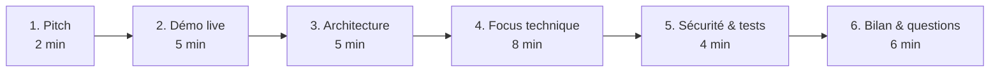

# TripGenie — Présenter le projet devant le jury
> Holberton Demo Day + soutenance RNCP5 DWWM

---

## 0. La règle d'or

> **Le jury n'évalue pas « est-ce que ça marche » — il évalue « est-ce que TU comprends
> ce que tu as fait et POURQUOI ».**

Un projet modeste parfaitement expliqué bat un projet ambitieux récité par cœur.
À chaque choix technique, prépare la phrase : **« j'ai choisi X plutôt que Y parce que… »**.

---

## 1. Quelle branche présenter ?

| Branche | À présenter si… |
|---------|-----------------|
| **`mvp-DEMODAY`** (Prisma + Docker) | **Démo live** : démarre en 1 commande, reproductible, Prisma Studio impressionne visuellement. ✅ Recommandé pour le Demo Day. |
| **`feat/postgres-rls`** (pg + RLS maison) | **Discussion sécurité approfondie** : montre la défense en profondeur (RLS au niveau base). Argument fort côté cybersécurité. |

**Stratégie gagnante :** présenter `mvp-DEMODAY` en démo, et **mentionner** que tu as
aussi une branche avec du RLS PostgreSQL maison (« j'ai exploré deux approches de la
couche données, je peux en parler si vous le souhaitez »). Ça montre de la maturité.

---

## 2. Structure de la soutenance (≈ 20-30 min)



### 1) Le pitch (2 min) — le problème AVANT la solution
> « Les sites comme Booking ou Kayak sont des **agrégateurs** : ils renvoient 300 résultats
> bruts, l'utilisateur choisit seul. TripGenie fait la **synthèse à sa place** : l'utilisateur
> décrit son voyage en une phrase, et reçoit un pack clé en main — vols, hôtels, itinéraire,
> budget — adapté à son style (luxe, fête, étudiant…), via un **pipeline IA + un scoring
> multi-critères**. »

### 2) La démo live (5 min) — voir § 4

### 3) L'architecture (5 min)
Montre le schéma 3 couches (doc 01). Explique le trajet d'**une** requête de bout en bout.
> « Quand l'utilisateur génère un pack : le frontend appelle l'API, qui valide avec Zod,
> lance des recherches externes en parallèle, demande au LLM d'assembler le pack, le score
> avec un algorithme déterministe, et le persiste via Prisma. »

### 4) Focus technique (8 min) — choisis 2-3 sujets que tu MAÎTRISES
Suggestions à fort impact :
- **Le pipeline IA orchestré** (`Promise.allSettled`, fallback gracieux).
- **L'authentification JWT en cookie httpOnly** (pourquoi pas localStorage).
- **Le passage à l'ORM Prisma** (schéma déclaratif, migrations versionnées, client typé).

### 5) Sécurité & tests (4 min)
JWT httpOnly, validation Zod, isolation par `user_id`, **282 tests** (unitaires, sécurité,
intégration). Montre un test qui prouve l'isolation (User B → 404).

### 6) Bilan (6 min)
Ce qui marche, ce que tu améliorerais, ce que tu as appris. Puis questions.

---

## 3. L'approche de construction du code attendue par le jury

Le jury DWWM attend que tu démontres ces réflexes :

| Attendu | Comment le montrer dans TripGenie |
|---------|-----------------------------------|
| **Séparation des responsabilités** | 3 couches ; routes → services → Prisma ; `api.ts` façade unique côté front |
| **Validation des entrées** | Zod sur **chaque** route avant tout traitement |
| **Gestion d'erreurs** | `try/catch` + `next(err)` → `globalErrorHandler` ; codes HTTP corrects |
| **Sécurité by design** | httpOnly, bcrypt, helmet, rate-limit, isolation `user_id` |
| **Code lisible** | nommage clair, commentaires sur le « pourquoi », fonctions courtes |
| **Tests** | TDD sur scoring/auth/validation ; mocks des services externes |
| **Versioning** | commits atomiques en français, branches par fonctionnalité |
| **Dégradation gracieuse** | `allSettled`, fallback Foursquare→Yelp→[], fallback LLM Gemini→OpenRouter→Claude→mocks |

> **Comment EXPLIQUER une fonction au jury :** ne lis pas le code ligne par ligne. Dis
> d'abord **ce qu'elle fait** (son intention), puis **pourquoi elle est écrite ainsi**
> (le choix), et seulement si on te le demande, **comment** (le détail).

---

## 4. Déroulé exact de la DÉMO live

> ⚙️ **Préparation (avant le jury, à froid) :**
> ```bash
> docker start tripgenie-db        # la base
> npm run db:seed                  # données de démo fraîches
> npm run prisma:studio            # onglet navigateur 1 (visuel base)
> npm run dev                      # API (terminal)
> npm run client:dev               # onglet navigateur 2 (l'app)
> ```

### Script de démo (5 min)
1. **Page d'accueil** → « voici la conciergerie ». Lancer le **chat onboarding**.
2. **Quiz guidé** : occasion → voyageurs → budget → dates → durée → **récap** → confirmer.
   *(montre les corrections UX : input date précise, récap avant génération).*
3. **Génération** : le loader s'affiche, ~15-30 s → **le pack complet apparaît**
   (vols, hôtels, activités réelles, météo, budget en camembert, carte).
4. **Connexion** → le pack est **sauvegardé** → onglet « Mes voyages ».
5. **Prisma Studio** (le moment fort) : « et voici la donnée, en temps réel, dans la base »
   → montrer la ligne `trips` qui vient d'être créée, la relation avec `packs`.
6. **Partage** (optionnel) : copier le lien public, montrer le vote sans compte.

### Si Internet/quota LLM tombe pendant la démo
> « Le système est conçu pour ça » → le **bandeau orange** « mode démonstration »
> s'affiche, les **mocks** prennent le relais. **C'est un argument, pas un échec.**

### Plan B (zéro réseau)
Avoir une **capture vidéo** de la génération réussie + le seed déjà en base pour
montrer « Mes voyages » et Prisma Studio sans dépendre du LLM.

---

## 5. Questions jury anticipées (réponses courtes)

**« Pourquoi un ORM maintenant ? »**
> Schéma déclaratif unique, migrations versionnées automatiques (fini le SQL à la main),
> client 100 % typé. Le SQL généré reste paramétré → pas d'injection.

**« C'est quoi un pipeline orchestré, pas un agent ? »**
> Les étapes sont prédéfinies et toujours dans le même ordre (analyse→recherche→assemblage→scoring).
> Un agent autonome choisirait lui-même ses outils. Seul mon chat de modification est agentique.

**« Comment sécurises-tu les données ? »**
> 3 niveaux : JWT en cookie httpOnly (vol par XSS impossible), validation Zod (injection
> impossible), filtre `user_id` sur chaque requête (isolation). Démontré par un test.

**« Pourquoi JavaScript/TypeScript et pas Python ? »**
> Full-stack JS = un seul langage, un seul runtime, un seul déploiement. TypeScript ajoute
> la sécurité de type. (Et je connais Python via la formation — c'est un choix, pas une limite.)

**« C'est quoi une transaction ? »** → voir doc 05.

**« camelCase vs snake_case ? »** → voir doc 05.

---

## 6. Erreurs à ne PAS commettre
- ❌ Lire le code à voix haute ligne par ligne.
- ❌ Dire « j'ai utilisé X » sans pouvoir dire **pourquoi**.
- ❌ Cacher ce que tu ne sais pas → dis « je ne l'ai pas exploré, mais voici comment je m'y prendrais ».
- ❌ Démo sans plan B (toujours un filet : seed + capture vidéo).
- ❌ Survoler la sécurité (c'est un gros critère DWWM).
