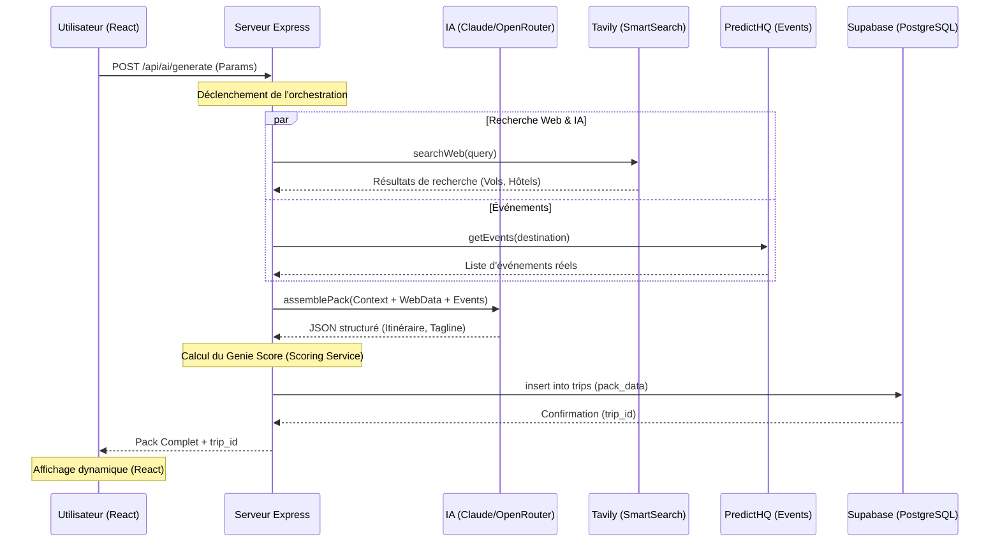
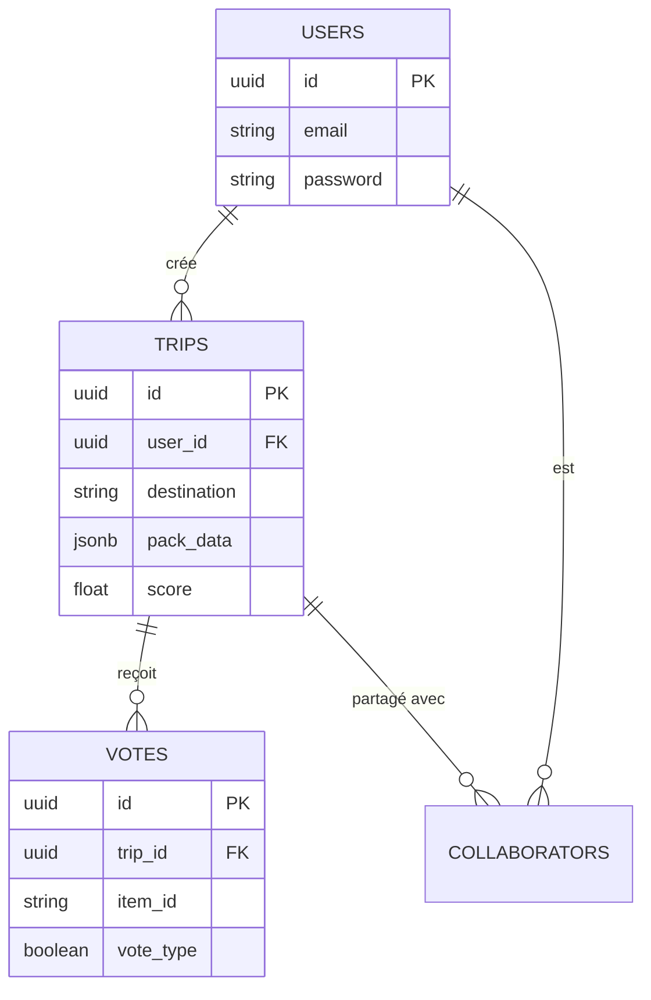

# 📊 Diagrammes Techniques — TripGenie

Ces diagrammes sont essentiels pour ton Dossier Professionnel et ton oral. Ils prouvent ta capacité à concevoir et à architecturer un système complexe.

---

## 1. Diagramme de Séquence : Orchestration SmartSearch
Ce diagramme montre comment le serveur "orchestre" les différentes APIs pour générer un voyage. C'est l'argument majeur de ta compétence **Back-End**.



---

## 2. Diagramme de Cas d'Utilisation (Use Case)
Il montre ce que l'utilisateur peut faire sur l'application.

```mermaid
usecaseDiagram
    actor "Utilisateur" as U
    actor "Administrateur" as A
    
    package TripGenie {
      usecase "Discuter avec l'IA (Onboarding)" as UC1
      usecase "Générer un Pack Voyage" as UC2
      usecase "Voter pour des activités (👍/👎)" as UC3
      usecase "S'authentifier (JWT)" as UC4
      usecase "Consulter ses anciens voyages" as UC5
      usecase "Partager un voyage" as UC6
    }
    
    U --> UC1
    U --> UC2
    U --> UC3
    U --> UC4
    U --> UC5
    U --> UC6
    
    A --|> U
    A --> "Modérer les contenus"
```

---

## 3. Diagramme de Base de Données (ERD)
Déjà présent dans ton DP, il valide ta compétence en **Modélisation Relationnelle**.



---

> [!TIP]
> **Pourquoi montrer ces diagrammes au jury ?**
> - **Séquence** : Prouve ta maîtrise de l'asynchronicité (`Promise.allSettled`) et de l'orchestration.
> - **Use Case** : Prouve que tu as compris les besoins utilisateurs (Cahier des charges).
> - **ERD** : Prouve que tu sais structurer des données SQL de manière professionnelle (UUID, FK).
