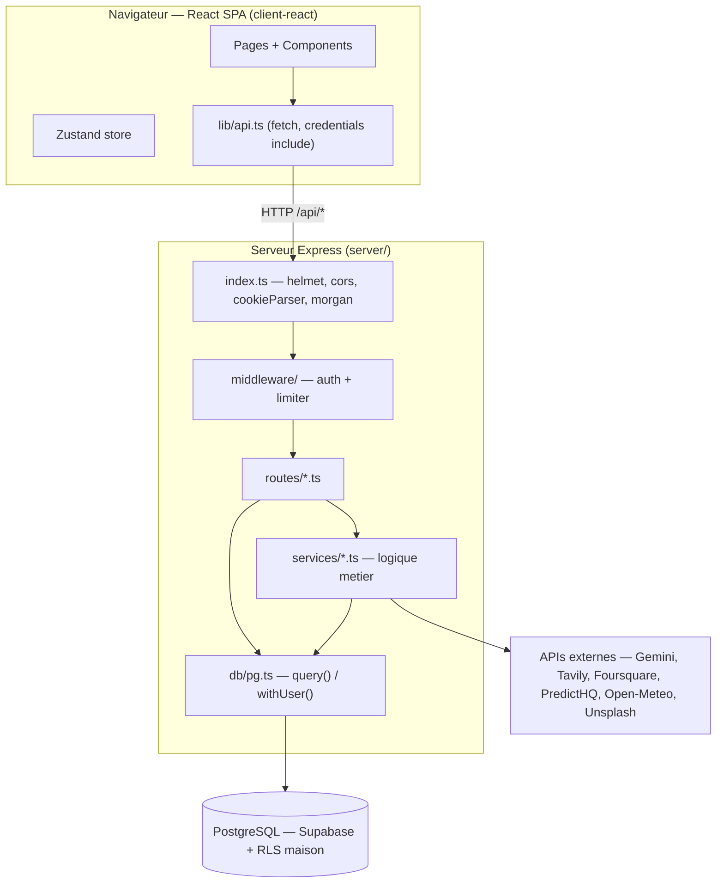
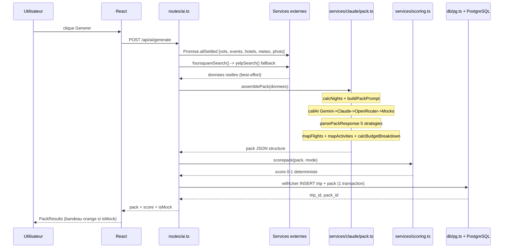
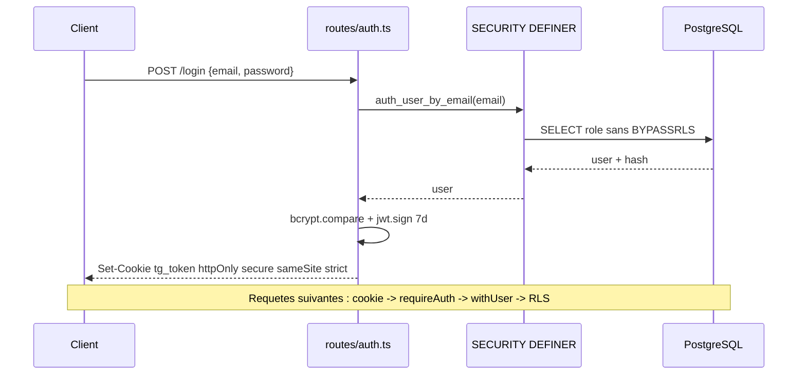
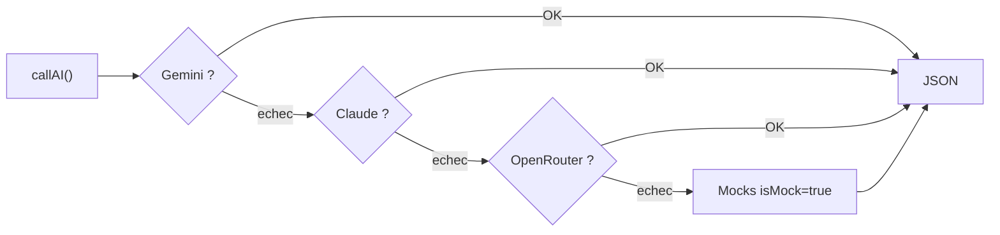
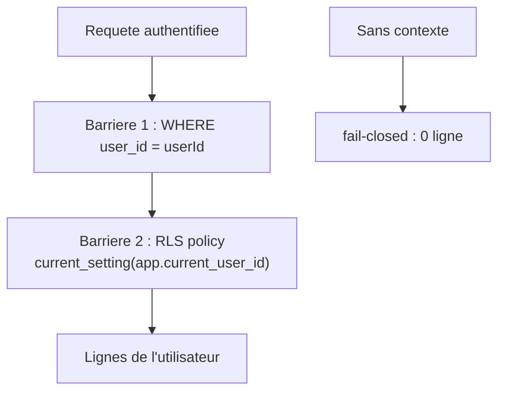
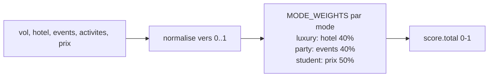
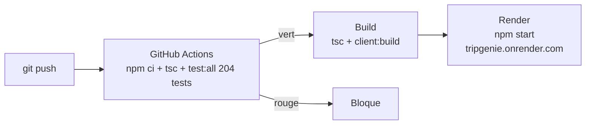
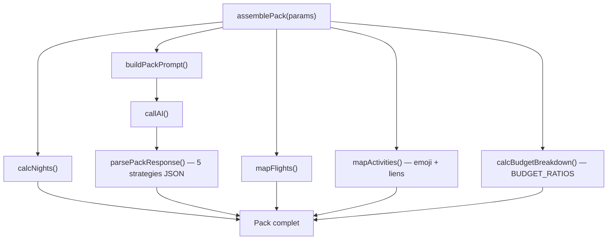

# TripGenie — Diagrammes (sources Mermaid)

> Mis à jour : juin 2026 — branche `feat/postgres-rls`

## 1. Vue d'ensemble — 3 couches

## 2. Pipeline génération — POST /api/ai/generate

## 3. Flux authentification

## 4. Cascade IA multi-provider

## 5. Double sécurité RLS

## 6. Scoring déterministe

## 7. CI/CD

## 8. assemblePack — 6 fonctions pures

