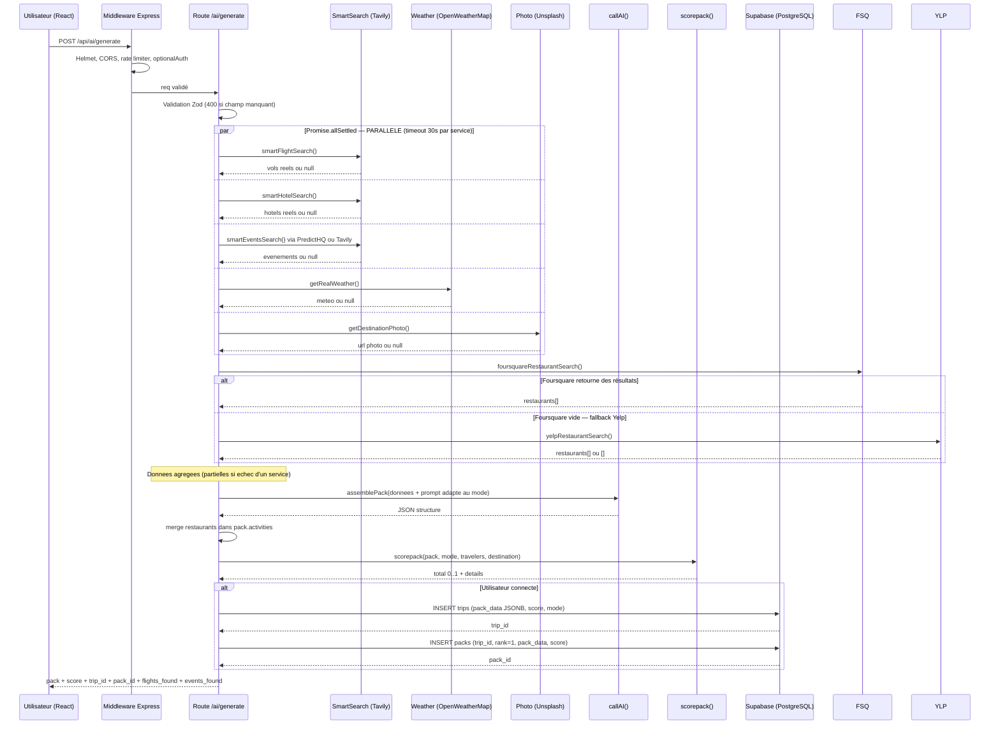
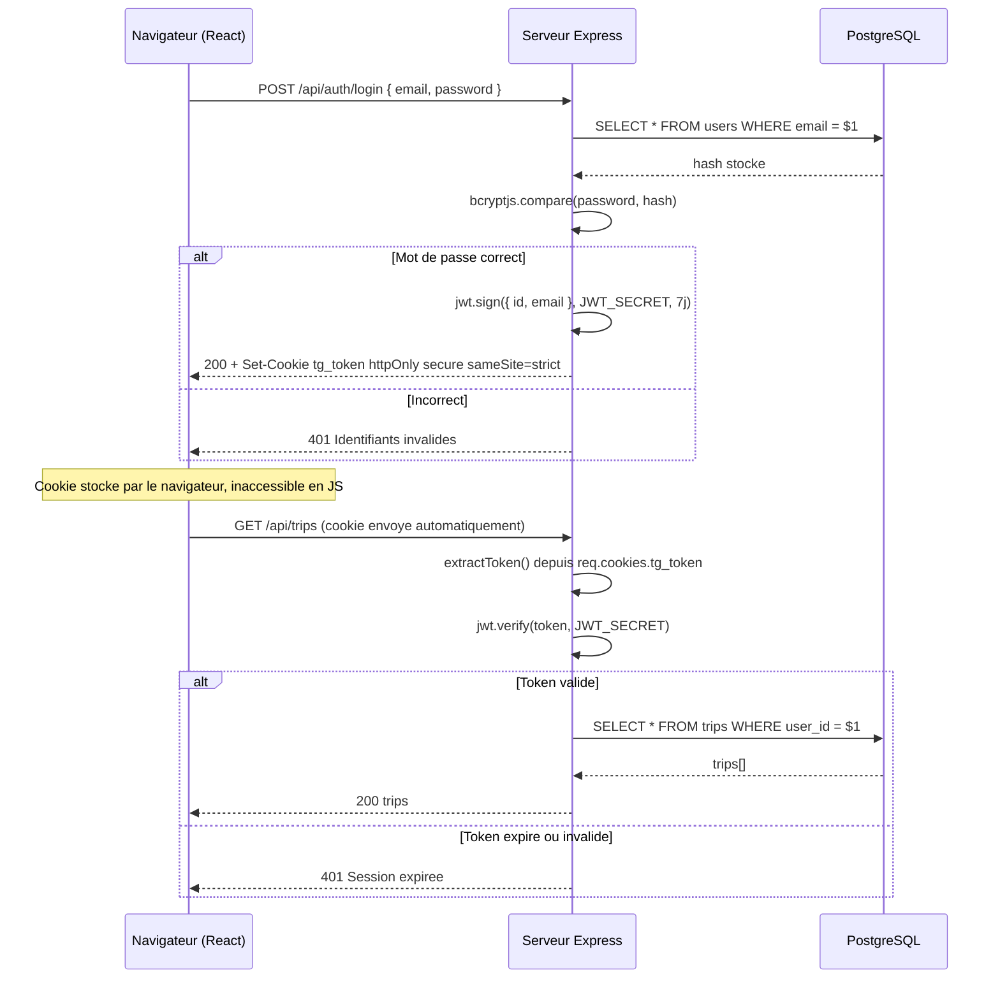
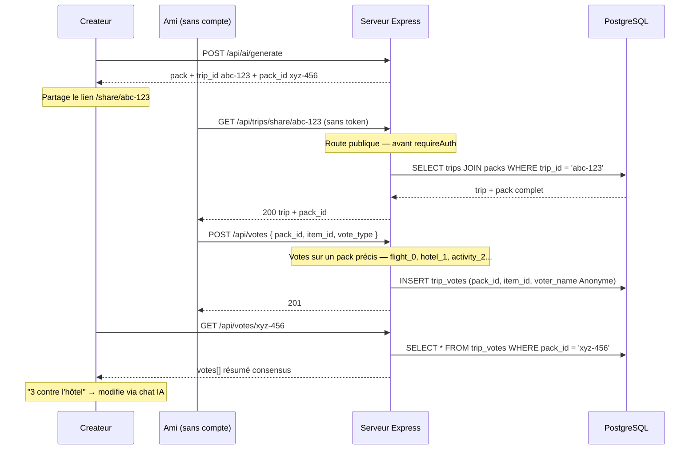
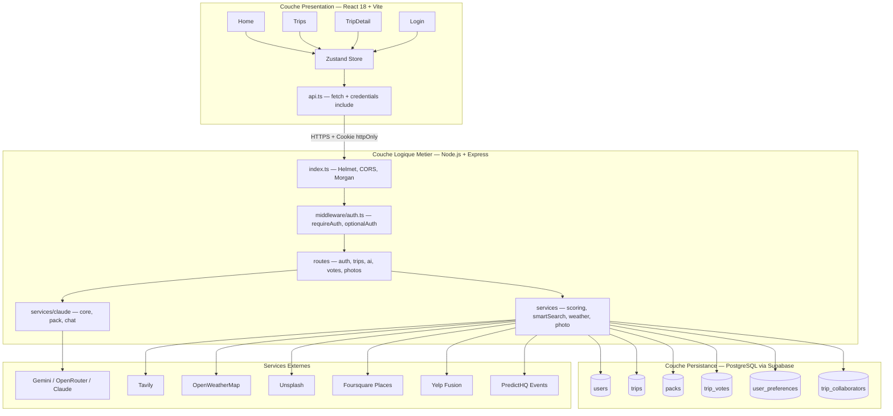
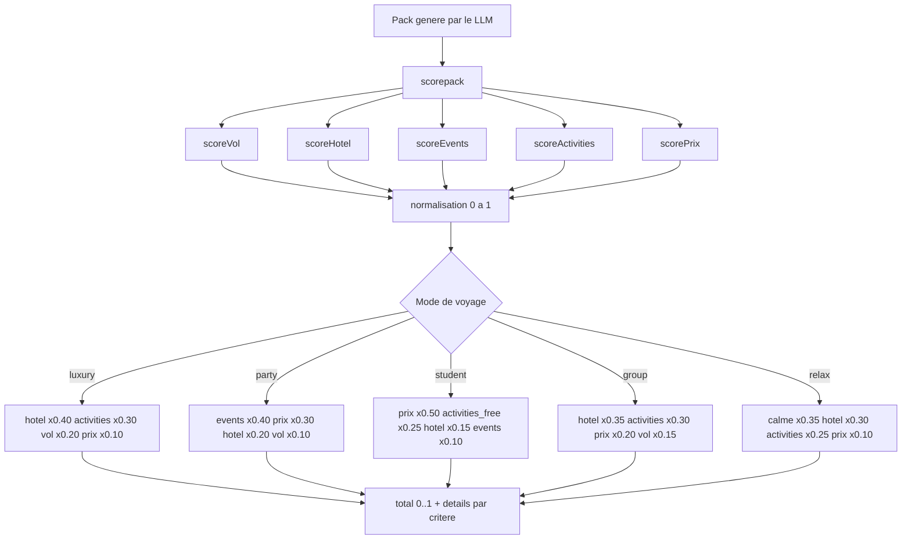
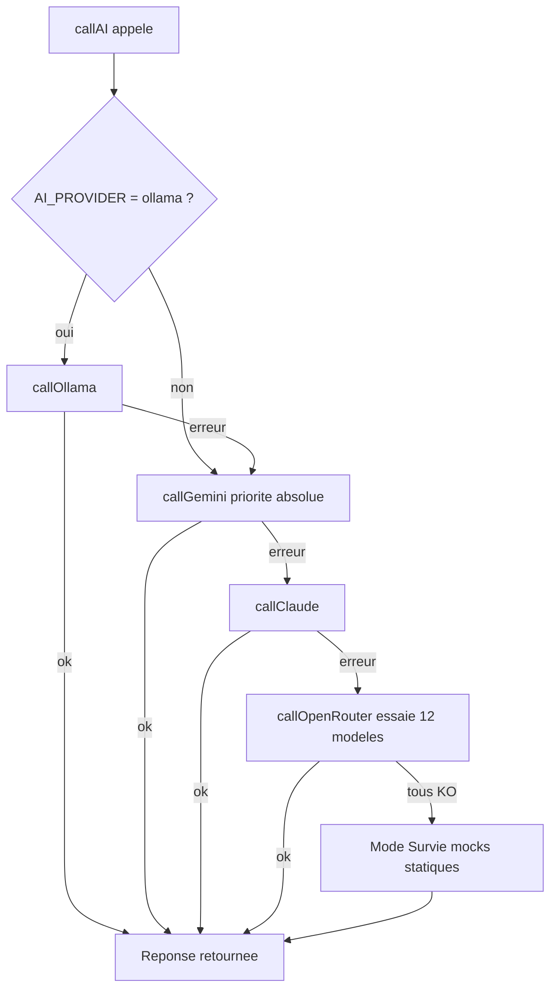

# Diagrammes Techniques — TripGenie

---

## 1. ERD — Modèle Entité-Relation (6 tables)

```mermaid
erDiagram
    USERS ||--o{ TRIPS : "crée"
    USERS ||--o| USER_PREFERENCES : "possède"
    USERS ||--o{ TRIP_COLLABORATORS : "participe à"
    TRIPS ||--o{ PACKS : "contient"
    TRIPS ||--o{ TRIP_COLLABORATORS : "partage avec"
    PACKS ||--o{ TRIP_VOTES : "reçoit"

    USERS {
        uuid id PK
        text email UK
        text password
        text name
        text avatar_url
        timestamptz created_at
    }

    TRIPS {
        uuid id PK
        uuid user_id FK
        text title
        text destination
        text origin
        date departure
        date return_date
        int travelers
        text budget
        text mode
        text status
        float score
        jsonb pack_data
        timestamptz created_at
        timestamptz updated_at
    }

    PACKS {
        uuid id PK
        uuid trip_id FK
        int rank
        float score
        jsonb pack_data
        boolean selected
        timestamptz created_at
    }

    TRIP_VOTES {
        uuid id PK
        uuid pack_id FK
        text item_id
        text voter_name
        boolean vote_type
        timestamptz created_at
    }

    USER_PREFERENCES {
        uuid user_id PK-FK
        text default_mode
        text[] preferred_prefs
        text home_city
        text currency
        timestamptz updated_at
    }

    TRIP_COLLABORATORS {
        uuid trip_id PK-FK
        uuid user_id PK-FK
        text role
        timestamptz invited_at
    }
```

---

## 2. Diagramme de Séquence — Pipeline de Génération



---

## 3. Diagramme de Séquence — Authentification JWT



---

## 4. Diagramme de Séquence — Vote Consensus



---

## 5. Architecture 3 Couches



---

## 6. Algorithme de Scoring — Flux



---

## 7. Fallback LLM — Chaîne de Résilience


