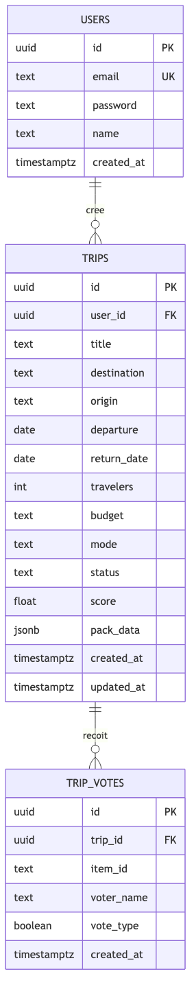
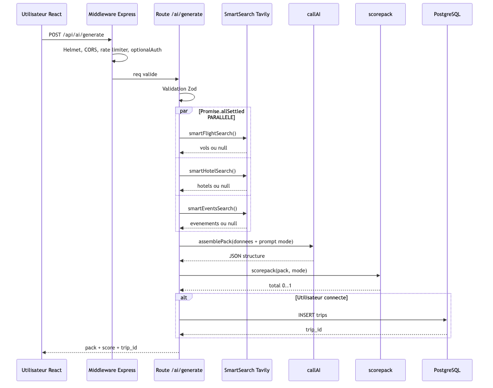
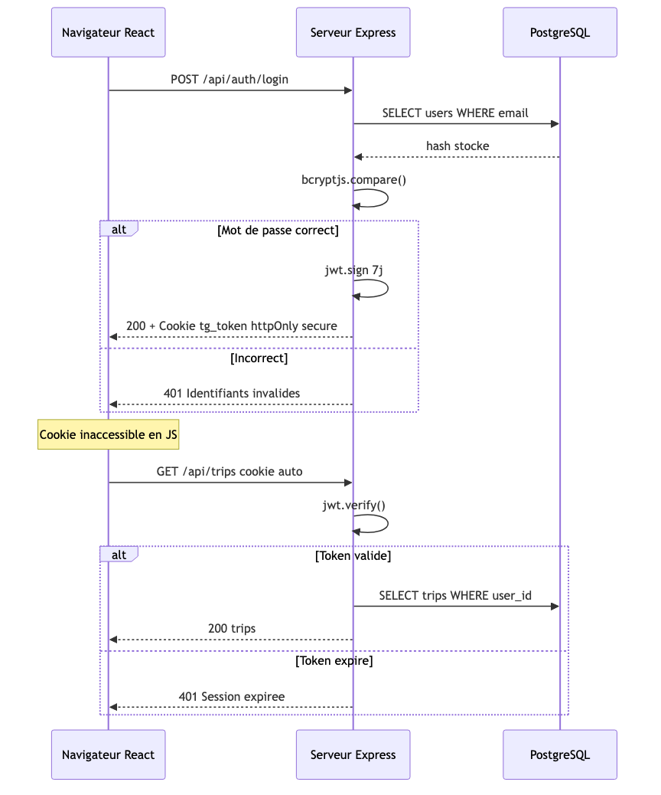
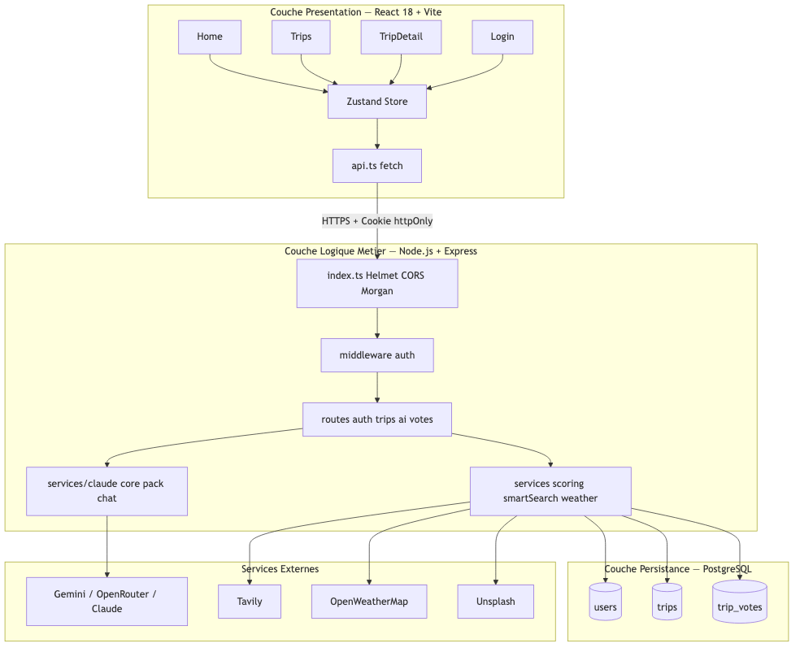
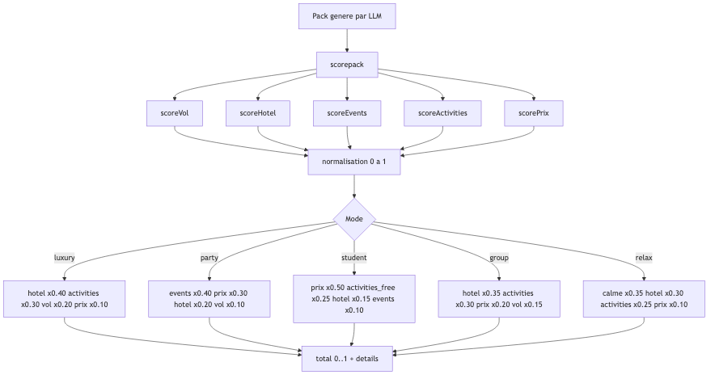
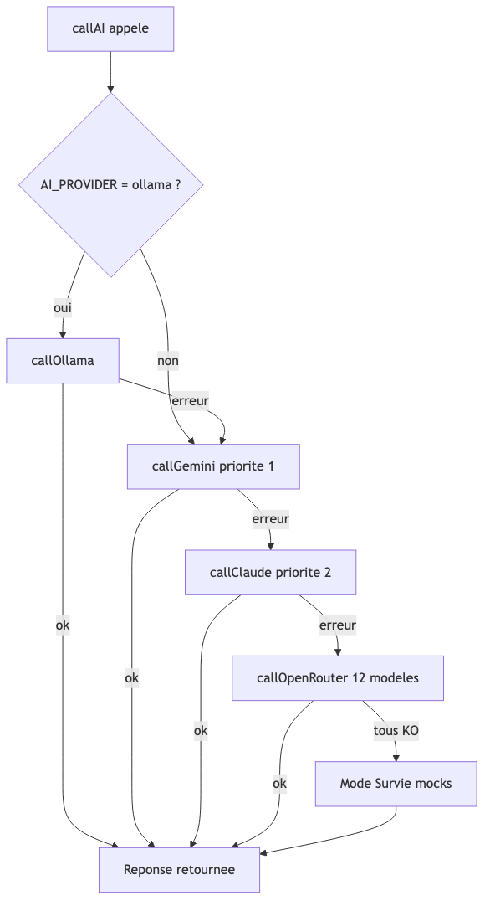

# Diagrammes Techniques — TripGenie (visuels)

> Images générées depuis [`DIAGRAMS.md`](./DIAGRAMS.md). Pour modifier un diagramme, éditer `DIAGRAMS.md` puis relancer `npm run diagrams`.

---

## 1. ERD — Modèle Entité-Relation

---

## 2. Diagramme de Séquence — Pipeline de Génération

---

## 3. Diagramme de Séquence — Authentification JWT

---

## 4. Architecture 3 Couches

---

## 5. Algorithme de Scoring

---

## 6. Fallback LLM — Chaîne de Résilience

