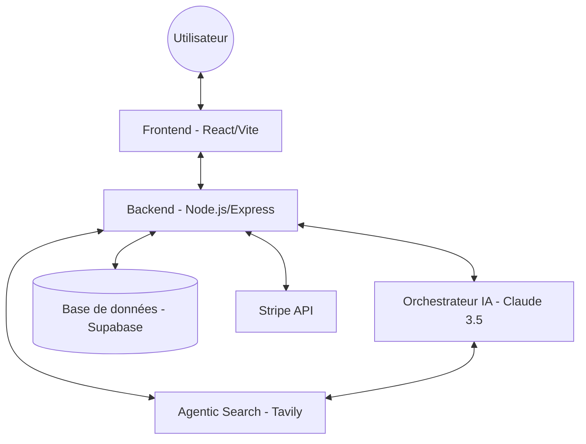
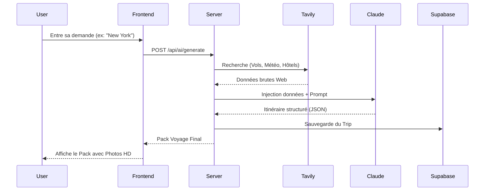

# TripGenie - Documentation Technique (MVP)
**Étape 3 : Spécifications & Architecture**

## 1. User Stories & Maquettes (Priorisation MoSCoW)

### Must Have (Indispensable)
*   **En tant qu'utilisateur**, je veux discuter avec un assistant IA pour définir mon profil de voyageur, afin d'obtenir des recommandations personnalisées.
*   **En tant qu'utilisateur**, je veux voir un itinéraire complet (vols, hôtels, activités) en données réelles, afin de planifier mon voyage concrètement.
*   **En tant qu'utilisateur**, je veux pouvoir m'inscrire et me connecter, afin de sauvegarder mes voyages préférés.

### Should Have (Important)
*   **En tant qu'utilisateur**, je veux voir la météo en direct de ma destination, afin de savoir quoi mettre dans ma valise.
*   **En tant qu'utilisateur**, je veux voir des photos HD de ma destination et des hôtels, pour m'immerger dans l'expérience.

### Could Have (Bonus)
*   **En tant qu'utilisateur**, je veux pouvoir voter pour mes hôtels préférés, afin d'affiner mes choix futurs.
*   **En tant qu'utilisateur**, je veux pouvoir payer une réservation via Stripe, pour finaliser mon projet de voyage.

---

## 2. Architecture du Système

### Diagramme de Haut Niveau (Mermaid)

---

## 3. Conception des Composants & Base de Données

### Schéma de Base de Données (Supabase/PostgreSQL)
*   **Table `users`** : `id`, `email`, `password_hash`, `created_at`.
*   **Table `trips`** : `id`, `user_id`, `destination`, `pack_data` (JSONB), `created_at`.
*   **Table `votes`** : `id`, `user_id`, `trip_id`, `item_id`, `type` (hotel/activity).

### Composants Frontend (React)
*   `ChatWidget` : Gère l'interaction fluide avec l'assistant.
*   `PackResults` : Affiche l'itinéraire généré (Hero, Météo, Vols, Hôtels).
*   `HotelCard` : Affiche les détails et la photo HD d'un hôtel.

---

## 4. Diagrammes de Séquence (Interaction Clé)

### Cas : Génération d'un voyage

---

## 5. Spécifications API

### API Externes
*   **Tavily AI** : Recherche web temps réel pour éviter les hallucinations.
*   **Anthropic (Claude)** : Cerveau de l'application (LLM).
*   **Unsplash** : Récupération dynamique de photos HD.
*   **Stripe** : Gestion des paiements sécurisés.

### Points d'entrée Internes (API REST)
| Méthode | Path | Input | Output | Description |
| :--- | :--- | :--- | :--- | :--- |
| POST | `/api/ai/generate` | `JSON {destination, budget, ...}` | `JSON Pack` | Génère un voyage complet via l'IA. |
| GET | `/api/trips` | `Token Auth` | `Array Trips` | Récupère les voyages sauvegardés de l'utilisateur. |
| POST | `/api/payments/create-session` | `tripId, amount` | `Stripe URL` | Initialise un tunnel de paiement. |

---

## 6. Stratégies SCM & QA

### SCM (Source Control Management)
*   **Outil** : Git & GitHub.
*   **Stratégie de Branches** : 
    *   `main` : Code stable pour la production.
    *   `develop` : Branche d'intégration des fonctionnalités.
    *   `feat/*` : Branches dédiées pour chaque nouvelle feature.
*   **Code Review** : Pull Requests obligatoires avant fusion dans `develop`.

### QA (Assurance Qualité)
*   **Tests Unitaires** : Vitest pour la logique de calcul de budget et scoring.
*   **Tests API** : Postman pour valider les endpoints.
*   **Linting** : ESLint pour garantir la qualité du code JS.

---

## 7. Justifications Techniques
*   **React/Vite** : Choisi pour la rapidité de développement et la fluidité de l'interface (SPA).
*   **Node/Express** : Pour sa gestion asynchrone performante des appels API multiples (Tavily, Claude, Unsplash).
*   **Tavily over PredictHQ** : Tavily permet une recherche web agentique beaucoup plus flexible et "Real-Time" pour un concierge de luxe.
*   **Supabase** : Permet d'avoir une DB PostgreSQL robuste avec une gestion d'authentification intégrée en un temps record.
