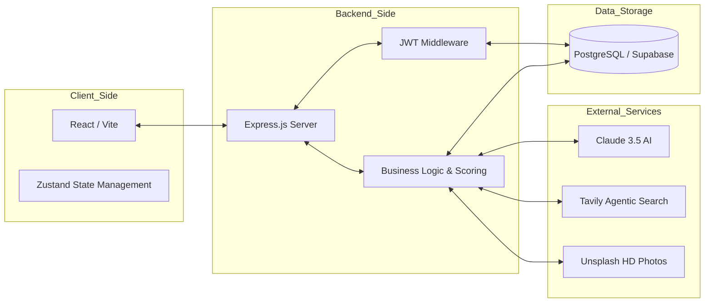
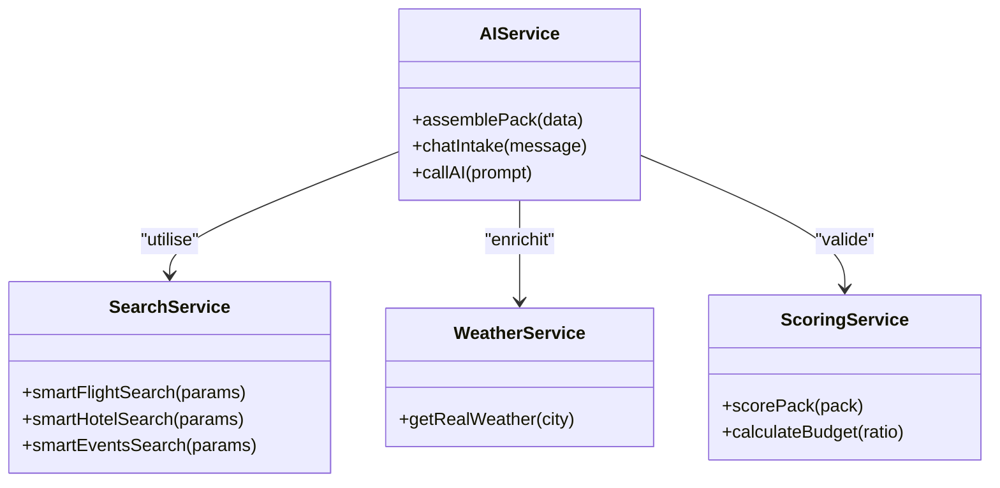
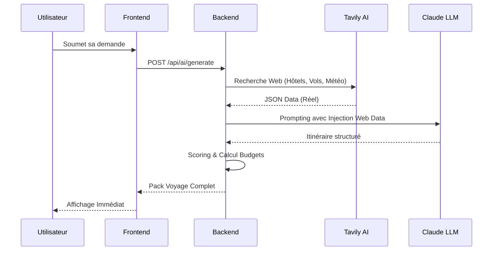

# TripGenie - Documentation Technique Détaillée (MVP)
**Étape 3 : Spécifications & Architecture Éclatées**
**Auteur :** Alexis Loties (Projet Solo)

---

## 1. User Stories & Maquettes (Format MoSCoW)

### Must Have
*   **Story 1** : En tant qu'utilisateur, je veux exprimer mes envies de voyage en langage naturel au bot, afin qu'il comprenne mon profil sans formulaires complexes.
*   **Story 2** : En tant qu'utilisateur, je veux un itinéraire chiffré (vols/hôtels/activités) basé sur des données réelles du web, pour garantir la faisabilité de mon séjour.
*   **Story 3** : En tant qu'utilisateur, je veux pouvoir m'authentifier de manière sécurisée (JWT), afin de retrouver mes sélections sur n'importe quel appareil.

### Should Have
*   **Story 4** : En tant qu'utilisateur, je veux voir la météo en temps réel et des photos HD via API, pour valider l'esthétique et le confort de la destination.
*   **Story 5** : En tant qu'utilisateur, je veux recevoir un lien de partage WhatsApp pour mon itinéraire, afin de le montrer à mes proches.

---

## 2. Architecture du Système (Full-Stack)

### Diagramme d'Infrastructure

---

## 3. Conception Technique (Classes & Data)

### Diagramme de Classes UML (Backend Services)

### Schéma de Base de Données Détaillé
| Table | Colonne | Type | Contrainte |
| :--- | :--- | :--- | :--- |
| **users** | `id` | UUID | PK, Unique |
| | `email` | VARCHAR | Unique, Not Null |
| | `password_hash` | TEXT | Not Null |
| **trips** | `id` | UUID | PK |
| | `user_id` | UUID | FK -> users.id |
| | `destination` | VARCHAR | Not Null |
| | `pack_data` | JSONB | Stocke l'itinéraire complet |
| | `created_at` | TIMESTAMP | Default NOW() |
| **votes** | `id` | BIGINT | PK |
| | `trip_id` | UUID | FK -> trips.id |
| | `item_id` | VARCHAR | ID de l'hôtel ou activité |

---

## 4. Diagrammes de Séquence (Flux Critiques)

### Interaction 1 : Génération de l'Itinéraire IA

---

## 5. Spécifications API REST

### Endpoints Internes
*   `POST /api/auth/register` : Création de compte.
*   `POST /api/auth/login` : Authentification et retour du JWT.
*   `POST /api/ai/generate` : Déclenchement de l'intelligence agentique.
*   `GET /api/trips` : Récupération de l'historique utilisateur.

---

## 6. Plans SCM & Assurance Qualité (QA)

### Gestion du Code (SCM)
*   **Workflow** : GitHub Flow simplifié (Main + Feature Branches).
*   **Commits** : Conventionnel (feat:, fix:, docs:, chore:).
*   **Review** : Auto-review systématique et tests de non-régression avant push.

### Stratégie de Tests (QA)
*   **Unit Testing** : Vitest pour les algorithmes de scoring (garantir que le budget total ne dépasse jamais le max utilisateur).
*   **API Testing** : Utilisation de Postman pour valider la structure des réponses JSON.
*   **E2E (Exploratoire)** : Tests manuels des flux critiques (Chat -> Génération).

---

## 7. Justifications Techniques
1.  **Node.js (Single Threaded Event Loop)** : Idéal pour gérer des dizaines d'appels API en parallèle (Tavily, Unsplash, Claude) sans bloquer le serveur.
2.  **Claude 3.5 Sonnet** : Choisi pour sa supériorité dans le respect des formats JSON stricts par rapport à GPT-4.
3.  **Tavily AI** : Utilisation pour le "RAG" (Retrieval Augmented Generation) en temps réel, évitant les hallucinations sur les prix des vols et la météo.
4.  **Tailwind CSS** : Pour une UI ultra-premium avec un temps de développement réduit, crucial en projet solo.
