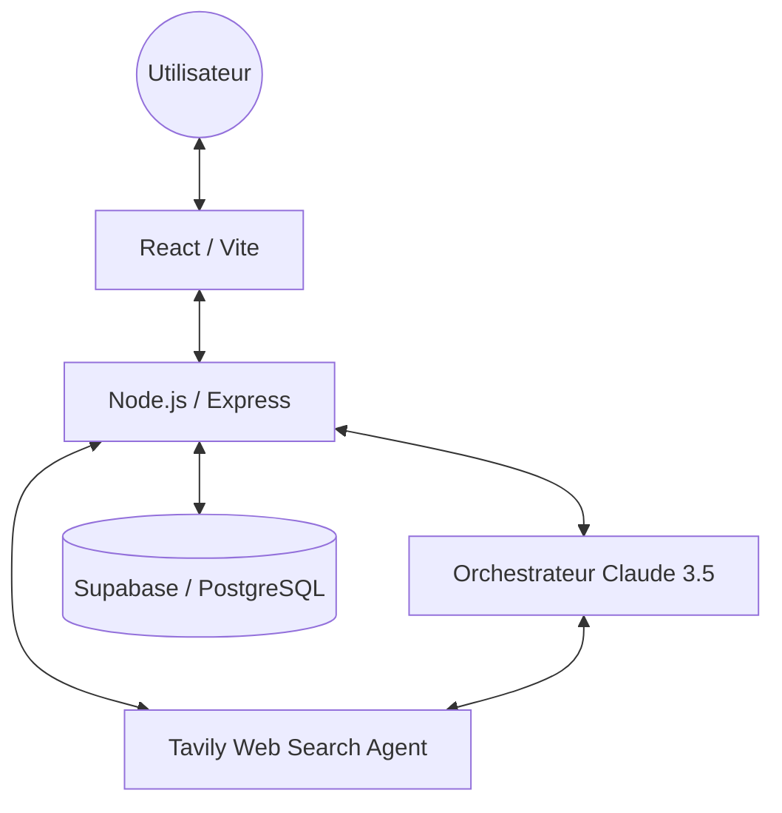
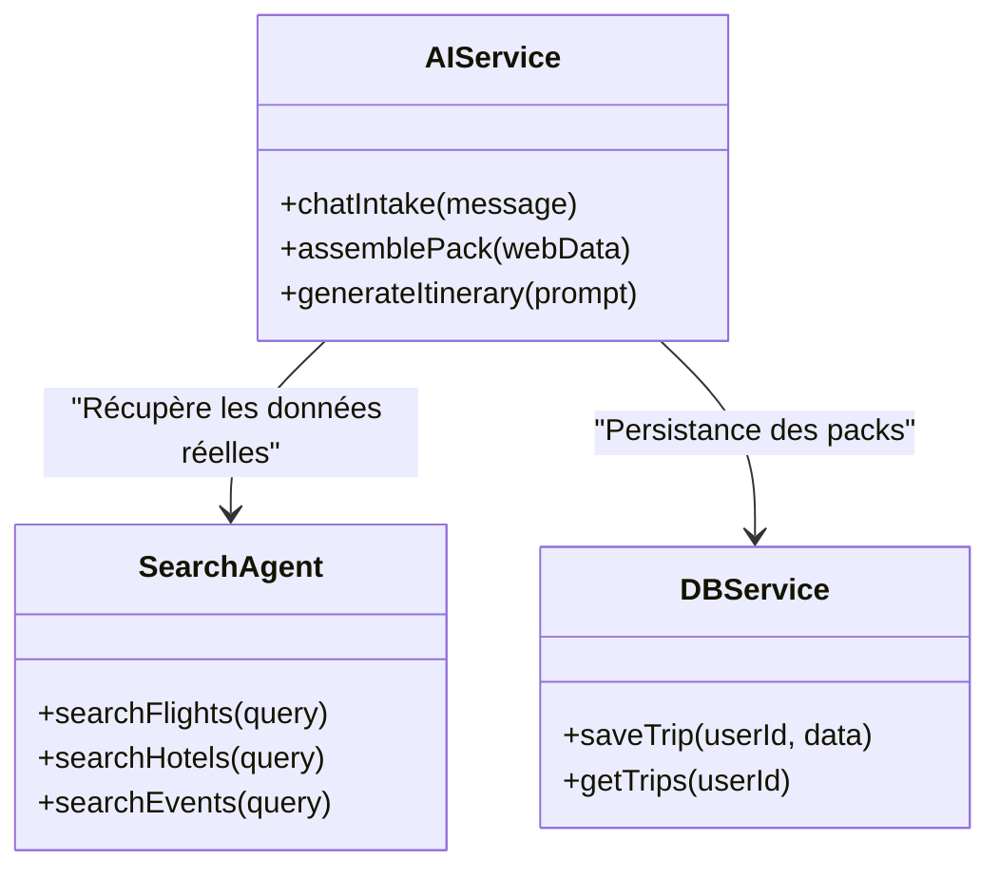
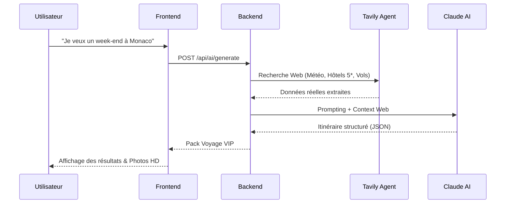

# TripGenie - Documentation Technique Détaillée (MVP Finale)
**Étape 3 : Spécifications & Architecture**
**Auteur :** Alexis Loties (Projet Solo - Certification)

---

## 1. User Stories & Maquettes (Priorisation MoSCoW)

### Must Have (Essentiel)
*   **Story 1** : En tant qu'utilisateur, je veux dialoguer naturellement avec un concierge IA pour définir mes envies de voyage (destinations, ambiance, budget), afin de ne pas remplir de longs formulaires complexes.
*   **Story 2** : En tant qu'utilisateur, je veux un itinéraire précis basé sur des données web réelles (Vols, Hôtels, Activités), afin d'avoir une estimation fiable du coût et de la faisabilité de mon séjour.
*   **Story 3** : En tant qu'utilisateur, je veux pouvoir m'inscrire et me connecter, afin de conserver mes voyages dans un espace personnel sécurisé.

### Should Have (Important)
*   **Story 4** : En tant qu'utilisateur, je veux voir la météo en direct et des photos HD de ma destination, pour mieux me projeter visuellement dans mon futur voyage.
*   **Story 5** : En tant qu'utilisateur, je veux pouvoir voter pour mes éléments préférés (hôtels ou activités) au sein d'un pack, afin de garder une trace de mes coups de cœur.
*   **Story 6** : En tant qu'utilisateur, je veux pouvoir consulter l'historique de tous mes voyages générés, afin de retrouver une ancienne planification en un clic.

### Could Have (Bonus)
*   **Story 7** : En tant qu'utilisateur, je veux pouvoir partager mon itinéraire via WhatsApp, afin de coordonner facilement mon projet de voyage avec mes proches.
*   **Story 8** : En tant qu'utilisateur, je veux pouvoir basculer entre le mode sombre et le mode clair, afin d'adapter l'interface à mon confort visuel et à mon environnement.
*   **Story 9** : En tant qu'utilisateur, je veux une interface fluide et "responsive", afin de pouvoir consulter mes détails de voyage confortablement sur mon smartphone.
*   **Story 10** : En tant qu'utilisateur, je veux voir les liens officiels des établissements suggérés, afin de pouvoir effectuer mes réservations finales en toute confiance.

---

## 2. Architecture du Système

### Diagramme d'Infrastructure

---

## 3. Conception Technique (Classes & Base de Données)

### Diagramme de Services (Backend)

### Schéma de Données (Supabase)
*   **Table `users`** : Gestion des comptes et sessions.
*   **Table `trips`** : Stockage des packs (format JSONB pour une flexibilité maximale des itinéraires).
*   **Table `votes`** : Enregistrement des préférences utilisateurs.

---

## 4. Diagrammes de Séquence (Flux Principal)

### Génération d'un Itinéraire Signature

---

## 5. Spécifications API REST (Internes & Externes)

### API Externes
*   **Tavily AI** : Agent de recherche web pour les données fraîches.
*   **Claude 3.5 Sonnet** : Logique de conciergerie et structuration JSON.
*   **Unsplash** : API de visuels haute résolution.

### Points d'entrée Internes
| Méthode | Path | Description |
| :--- | :--- | :--- |
| POST | `/api/auth/login` | Connexion utilisateur (JWT). |
| POST | `/api/ai/generate` | Orchestration de l'IA et génération du pack. |
| GET | `/api/trips` | Historique des voyages sauvegardés. |

---

## 6. Plans SCM & QA

### SCM (Git Flow)
*   **Branches** : Utilisation de branches de fonctionnalités (`feat/`) fusionnées vers `main` après validation.
*   **Commits** : Norme *Conventional Commits* pour une traçabilité claire.

### QA (Assurance Qualité)
*   **Tests** : Validation manuelle des flux critiques et tests de structure JSON via Vitest.
*   **Outils** : Postman pour le debug API et ESLint pour la qualité de code.

---

## 7. Justifications Techniques
*   **Tavily AI** : Choisi pour sa capacité à fournir des résultats web structurés, éliminant les hallucinations sur les prix et les disponibilités.
*   **Claude 3.5** : Meilleur modèle actuel pour le "JSON Output", crucial pour le rendu frontend sans erreurs.
*   **Supabase** : Solution BaaS performante permettant de se concentrer sur l'IA plutôt que sur l'infrastructure DB.
